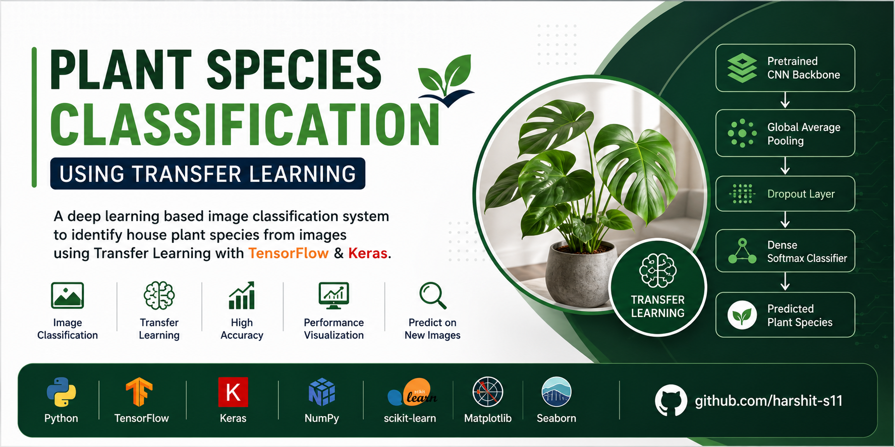

<p align="center">
  
</p>

# 🌿 Plant Species Classification using Transfer Learning

<p align="center">


</p>

A deep learning-based image classification system that identifies **house plant species** using **Transfer Learning** with TensorFlow and Keras.

The project demonstrates an end-to-end computer vision workflow, covering dataset preprocessing, transfer learning, model fine-tuning, evaluation, and prediction on unseen plant images.

---

# 📖 Project Overview

Plant species identification is an important computer vision application in agriculture, horticulture, and botanical research.

Instead of training a Convolutional Neural Network (CNN) from scratch, this project leverages **Transfer Learning** using a pretrained model to achieve higher classification accuracy while significantly reducing training time.

The notebook demonstrates the complete deep learning pipeline from dataset preparation to model evaluation and prediction.

---

# ✨ Features

- Image preprocessing and cleaning
- Dataset splitting (Training, Validation & Test)
- Data augmentation
- Transfer Learning using pretrained CNN
- Fine-tuning for improved performance
- Model evaluation
- Prediction on unseen plant images
- Training history visualization
- End-to-end implementation in Jupyter Notebook

---

# 🛠 Tech Stack

- Python
- TensorFlow
- Keras
- NumPy
- Matplotlib
- Seaborn
- Scikit-learn
- Jupyter Notebook

---

# 🧠 Model Pipeline

```text
Input Images
      │
      ▼
Image Preprocessing
      │
      ▼
Data Augmentation
      │
      ▼
Pretrained CNN Backbone
      │
      ▼
Global Average Pooling
      │
      ▼
Dropout Layer
      │
      ▼
Dense Softmax Classifier
      │
      ▼
Plant Species Prediction
```

---

# 📂 Project Structure

```text
Plant-Species-Classification-Transfer-Learning/
│
├── assets/
│   ├── banner.png
│   └── screenshots/
│
├── model-final.ipynb
├── requirements.txt
├── README.md
└── .gitignore
```

---

# 📊 Dataset

The model is trained on an image dataset containing multiple house plant species.

Dataset preparation includes:

- Removing corrupted images
- Organizing class-wise folders
- Creating Train / Validation / Test datasets
- Applying image augmentation techniques

> **Note:** The dataset is not included due to its large size.

---

# 🚀 Getting Started

## Clone Repository

```bash
git clone https://github.com/harshit-s11/Plant-Species-Classification-Transfer-Learning.git
```

---

## Navigate to Project

```bash
cd Plant-Species-Classification-Transfer-Learning
```

---

## Install Dependencies

```bash
pip install -r requirements.txt
```

---

## Launch Jupyter Notebook

```bash
jupyter notebook
```

Open:

```text
model-final.ipynb
```

---

# 📈 Results

The notebook provides:

- Training Accuracy
- Validation Accuracy
- Training Loss
- Validation Loss
- Prediction Results
- Performance Visualization
- Model Evaluation Metrics

---

# 🌱 Applications

- Smart Gardening
- Plant Species Identification
- Agricultural Technology
- Botanical Research
- Educational Computer Vision Projects

---

# 🔮 Future Improvements

- Flask Web Application
- FastAPI Deployment
- Streamlit Interface
- Mobile Application
- TensorFlow Lite Deployment
- Raspberry Pi Edge Deployment
- Additional Plant Species Support

---

# 📚 Learning Outcomes

This project provided practical experience with:

- Transfer Learning
- Computer Vision
- Image Classification
- Deep Learning Pipelines
- TensorFlow & Keras
- Data Augmentation
- Model Fine-tuning
- Performance Evaluation

---

# 📜 License

This project is licensed under the **MIT License**.

---

# 👨‍💻 Author

**Harshit Sharma**

Final-year B.Tech Computer Science Engineering Student

VIT Chennai

🔗 GitHub: https://github.com/harshit-s11

🔗 LinkedIn: https://linkedin.com/in/harshit-sharma24

---

⭐ If you found this repository helpful, consider giving it a star.
